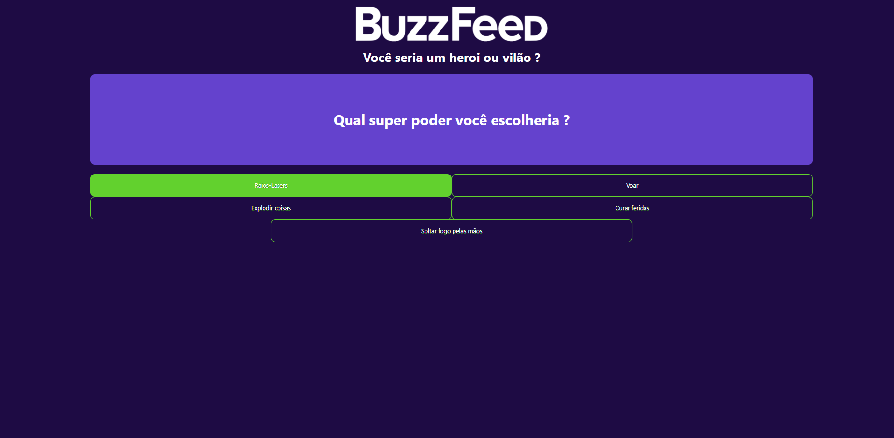

# AngularBuzzfeed

BuzzFeed Clone with Angular

# Quizz

# Quizz Result

# How To Run

Insert these comands in comand line

- `npm install`  -> _Installs the project dependencies_
- `ng serve` -> _Starts the Angular application in a development server_

If you want Angular to open automatically in the browser, use:

- `ng serve --open`

